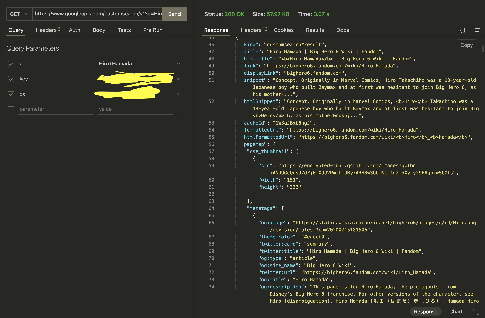
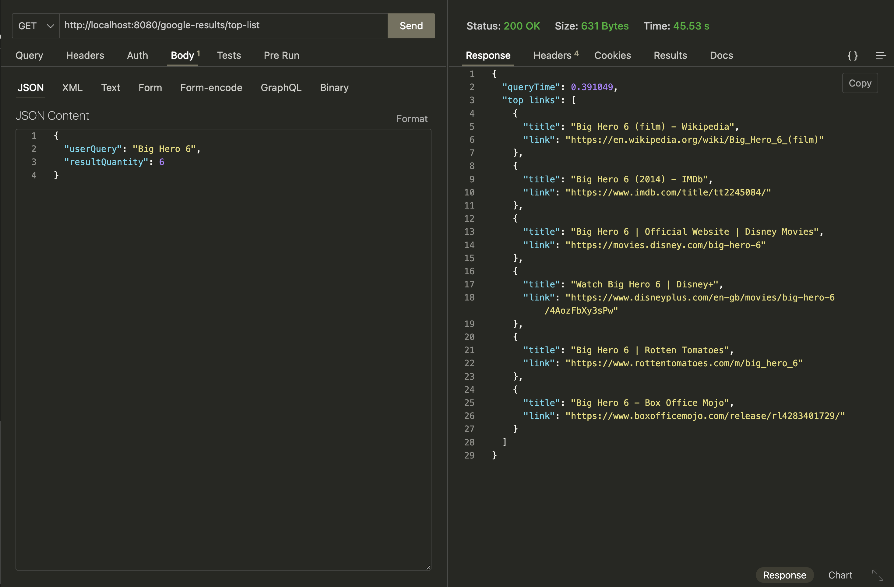
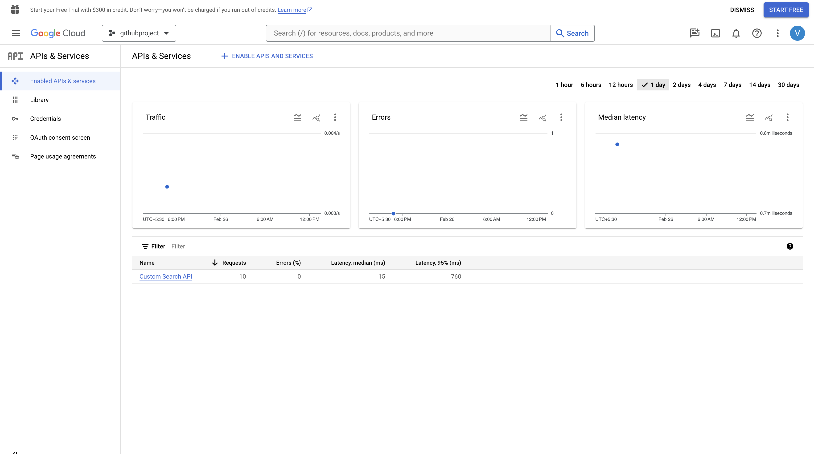

# Introduction
Introducing a convenient service designed to simplify your Google search experience.
This service allows users to input specific search queries, and in return, it fetches and presents the number of titles relevant to your search. 
This tool streamlines the process of extracting valuable information from Google, providing you with a quick and efficient summary of the number of titles associated with your search terms. 

# Tech
goversion : 1.21.7
OS - macOs
framework - gin
provider : google search
IDE : IntelliJ IDEA

# Run the service
go run cmd/config-loader.go cmd/main.go

# FAQ
1.How to create google api key and custom search engine id used in .env file? : https://support.google.com/googleapi/answer/6158862?hl=en

# Images
1. Hitting google/ provider api

2. Hitting the microservice api

4. Dashboard
